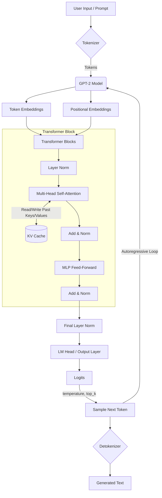
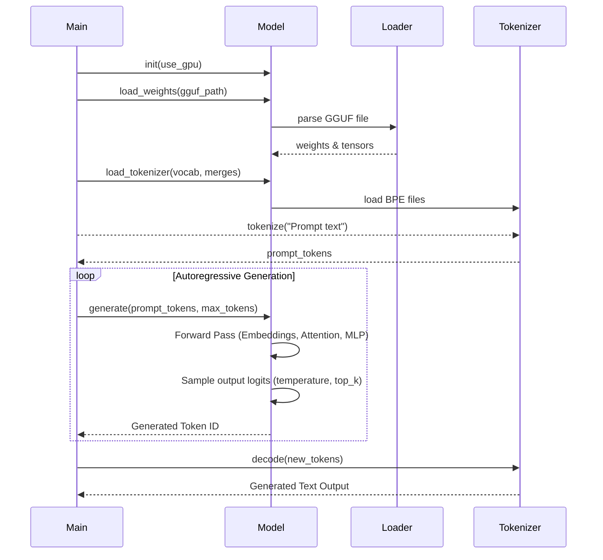

# GPT-2 Inference Engine

A C++ inference engine for GPT-2 (124M parameters) built on top of [ggml](https://github.com/ggerganov/ggml). Supports GGUF model loading, CUDA GPU acceleration, and autoregressive text generation with temperature/top-k sampling.

## Project Structure

```
inference-engine/
├── src/
│   ├── main.cpp          # Entry point, CLI argument handling
│   ├── model.hpp/cpp     # GPT2Model class, GGML backend setup
│   ├── layers.hpp/cpp    # Transformer layers (Attention, FFN, LayerNorm)
│   ├── kv_cache.hpp/cpp  # KV cache implementation
│   ├── tokenizer.hpp/cpp # BPE tokenizer (vocab + merges)
│   └── gguf_loader.h/cpp # GGUF file format loader
├── tests/
│   ├── test_model_loading.cpp
│   ├── test_attention.cpp
│   ├── test_ffn.cpp
│   ├── test_layer_norm.cpp
│   ├── test_forward_pass.cpp
│   ├── test_wte_diagnosis.cpp
│   └── test_gguf_loader.cpp
└── CMakeLists.txt
```

## Architecture

GPT-2 (124M): 12 layers, 768 hidden size, 12 attention heads, 3072 FFN intermediate size, 50257 vocabulary size.

### Transformer Block
```
Input → LayerNorm → Multi-Head Self-Attention → Add & Norm → FFN (GELU) → Add & Norm → Output
                    ↑
              KV Cache (read/write)
```

### Inference Pipeline



### Execution Flow



## Prerequisites

- **CMake** (3.16+)
- **CUDA Toolkit** (for GPU acceleration, targets sm_75/T4 by default)
- **ggml** library

## Building

1. **Clone and build ggml** (parallel to this repository by default, or provide path via `-DGGML_DIR`):
   ```bash
   git clone https://github.com/ggerganov/ggml.git ../ggml
   cd ../ggml
   mkdir build && cd build
   cmake ..
   make -j
   ```

2. **Build the engine:**
   ```bash
   mkdir build && cd build
   cmake ..
   make -j
   ```

   The executable is placed in `build/bin/gpt2`.

## Running Inference

```bash
./build/bin/gpt2 <prompt> [max_tokens] [temperature] [top_k]
```

| Argument    | Description                          | Default |
|-------------|--------------------------------------|---------|
| `prompt`    | Input text                           | (required) |
| `max_tokens`| Maximum tokens to generate           | 100     |
| `temperature`| Sampling temperature (lower = more deterministic) | 1.0 |
| `top_k`     | Top-k sampling parameter             | 50      |

**Example:**
```bash
./build/bin/gpt2 "Once upon a time" 50 0.8 50
```

**Output:**
```
=== GPT-2  Inference ===
Prompt: "the american flag is red and white and"
Max tokens: 50
Temperature: 0.3
Top-k: 40
==============================
ggml_cuda_init: found 1 CUDA devices (Total VRAM: 14912 MiB):
  Device 0: Tesla T4, compute capability 7.5, VMM: yes, VRAM: 14912 MiB
GPT-2  model initialized
  Layers: 12
  Hidden: 768
  Heads: 12
  FFN: 3072
  Vocab: 50257
Loading weights from: /content/gpt2-model/gpt2-bf16.gguf
Loading GGUF model from: /content/gpt2-model/gpt2-bf16.gguf
Model architecture: gpt2
Config: ctx=1024 embd=768 head=12 layer=12 ffn=3072

Sample tensor names:
  blk.0.attn_qkv.bias
  blk.0.attn_qkv.weight
  blk.0.attn_output.bias
  blk.0.attn_output.weight
  blk.0.attn_norm.bias
  ... (148 total tensors)

Loading tensors...

Loaded 148 tensors, 0 failed/skipped
GGUF model loaded successfully
Loading tokenizer from: /content/gpt2-model/vocab.json and /content/gpt2-model/merges.txt
Loaded 50257 vocab entries
Loaded 49996 BPE merges
Tokenizing prompt...
Prompt tokens: 9 tokens

Generating...
Output: Processing prompt (9 tokens)...
..................................................

Prompt: the american flag is red and white and
Generated:  the flag of the United States of America is blue and white."

The flag was flown by the United States flag during the Vietnam War.

The flag was flown by the United States flag during the Vietnam War.
```

## Model Files

The engine expects model files at these paths (hardcoded in `src/main.cpp`):

| File | Description |
|------|-------------|
| `/content/gpt2-model/gpt2-bf16.gguf` | GPT-2 weights in GGUF format |
| `/content/gpt2-model/vocab.json` | BPE vocabulary |
| `/content/gpt2-model/merges.txt` | BPE merge rules |

Modify `src/main.cpp` to use different paths.

## Running Tests

```bash
cd build
cmake .. -DBUILD_TESTS=ON
make -j
./bin/run_tests
```

Available tests:
- `test_model_loading` - GGUF model file loading and tensor validation
- `test_attention` - Multi-head self-attention computation
- `test_ffn` - Feed-forward network with GELU activation
- `test_layer_norm` - Layer normalization
- `test_forward_pass` - End-to-end forward pass validation
- `test_gguf_loader` - GGUF file format parsing

## Key Components

### GPT2Model
- Initializes GGML context and CUDA backend
- Loads GGUF weights and BPE tokenizer
- Implements autoregressive generation with KV caching

### TransformerBlock
- Pre-norm architecture: LayerNorm → Attention → Add → LayerNorm → FFN → Add
- Causal self-attention with rotary embeddings
- KV cache for efficient autoregressive decoding

### Attention
- Multi-head query/key/value projections
- Causal mask for autoregressive attention
- KV cache for storing and retrieving past keys/values

### FFN
- GELU activation: `0.5 * x * (1 + tanh(sqrt(2/pi) * (x + 0.044715 * x^3)))`
- Up-projection (768 → 3072) → GELU → Down-projection (3072 → 768)

## License

See [LICENSE](LICENSE).
